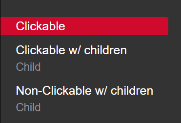

# Contributing

This is the documentation for contributing to an individual wiki. Please create an issue for any unclear or missing information. Documentation for contributing to the theme repository is a WIP.

## Basic contributing
To start contributing, fork the repository and make your changes. After you are done making your changes submit a pull request to the main repository with an explanation of your changes. For any help, please create an issue.

## Editing Content
To edit existing content in a wiki, navigate to the page you would like to edit on the website. Look at the URL and match that to the directory structure of the repo.

### Example
If you want to edit `https://sqlwiki.netspi.com/attackQueries/persistence`, you would navigate to `https://github.com/[YOUR_USERNAME]/SQLInjectionWiki/attackQueries/persistence.html` and make your changes in that file.

## Style

Follow the styles already set in the existing files if not listed below.

- All code snippets should be wrapped in `<code></code>`
- All top headers should be `<h3></h3>`
- All sub section headers should be `<h4 class="subheading"></h4>`
- Top level descriptions should be `

`
- Secondary descriptions should just be `

`
- All external links should be ``

## Section Types
There are only 3 types of sections allowed through our navigation style. 
- Clickable sections with children
- Clickable sections without children
- Non-clickable sections with children

Non-clickable sections are typically used as a title header for their children, when the children grouping don't need a description (i.e. "Miscellanious"). Clickable sections with children typically utilize the clickable section as a place to give an overview of the children.

## Adding a new section
To add a new section or child place it in the appropriate location.

### Clickable sections w/ children:
  * /sectionName/index.html #For the clickable section
  * /sectionName/childName.html #For each child
  
### Clickable sections w/o children:
  * /sectionName.html #For the clickable sectoin

### Non-clickable sections:
  * /sectionName/childName.html #For each child

After adding a new section, modify the \_data/nav.yml file and add the section in its proper place. There should only be 3 navigation types as stated in [Section Types](#section-types).

## URL Path Rules
When referencing a page through an href or other link tag use the following guidelines. Pay close attention to the existence or lack of a trailing backslash:
Clickable sections w/ children:
  * For the section link use /sectionName/
  * For the children links use /sectionName/childName
Clickable sections w/o children:
  * /sectionName
Non-clickable sections:
  * /sectionName/childName
